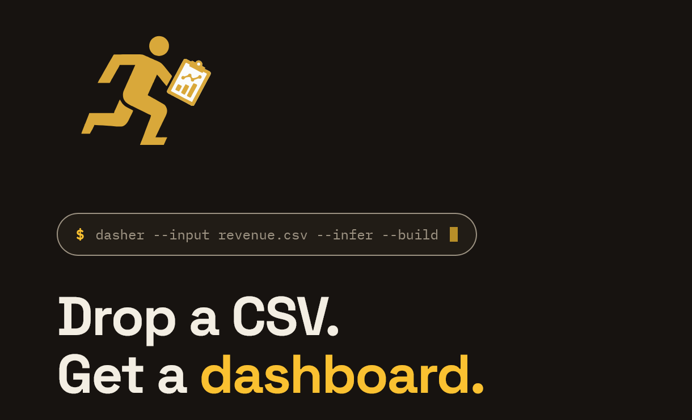
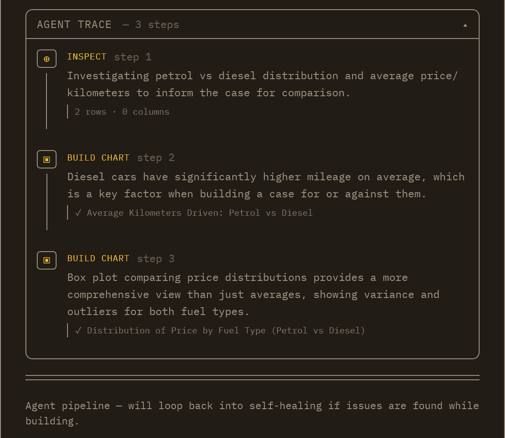
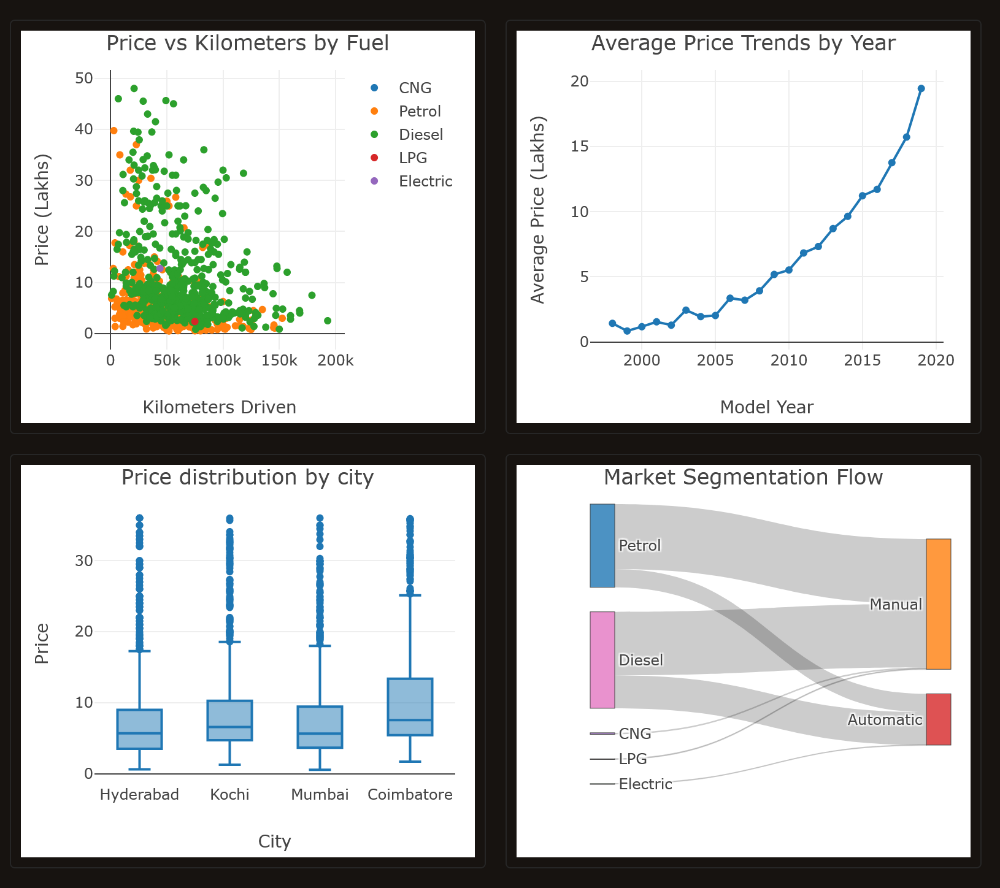
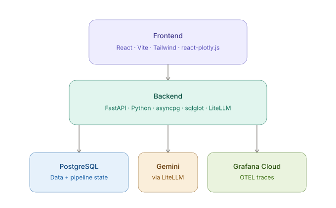

# Dasher


Upload a CSV. Get a fully configured, interactive dashboard in minutes.
No column mapping, no chart config, no BI expertise required, no third-party
BI tool to stand up and maintain.

**Stack:** FastAPI · React/Tailwind · PostgreSQL · react-plotly.js · LiteLLM · Gemini 3.1 Flash-Lite · asyncpg · httpx · PyJWT · OpenTelemetry

> Built with Claude as a development accelerator. Architecture decisions, product tradeoffs, and validation are the author's own.

---

Dasher is an AI-enabled dashboarding engine built to demonstrate agentic AI
patterns, production-grade API design, and end-to-end system thinking, all in
one project. It runs two build modes: a sequential pipeline (profile →
semantics → plan → build) and an agentic mode where an LLM orchestrates the
same pipeline via native function-calling, no LangChain, streaming its
progress to the client in real time over SSE. Both modes render a fully
interactive, shareable dashboard directly from a raw CSV upload, natively,
with zero external BI service in the rendering path.

## The problem

Getting from raw data to a useful dashboard normally means manually mapping
columns, choosing chart types, writing queries, and standing up a BI tool.
Dasher collapses the entire chain into one step: statistical profiling, LLM
semantic inference, dashboard planning, and native chart rendering, all
automatic. The only input required is a CSV.

---

## What it does

1. Upload a CSV, profiled automatically (stats, value counts, correlations)
2. LLM classifies every column: dimensions, measures, dates, flags, identifiers
3. Two-pass dashboard planning: analytical questions first, then charts
4. PostgreSQL-native charts executed and rendered natively via Plotly, zero external BI dependency
5. Agentic build mode streams live progress (inspect/build/heal/finish) over SSE, closing with an agent-authored rationale
6. Natural language authoring: add, edit, or delete charts post-build, right on the chart grid
7. Natural language insight engine against live data
8. One-click public sharing, frozen at publish time

---



## Two build modes

**Pipeline mode** runs a fixed sequence: profile the data, infer semantics,
plan the dashboard, build it. Predictable, fast, good default.

**Agent mode** hands an LLM a goal and a set of tools (`inspect_data`,
`build_and_add_chart`, `edit_existing_chart`, `delete_existing_chart`,
`finish`), then lets it decide what to inspect and build next, calling
tools directly via native function-calling, no LangChain. It's not just
"call the LLM once with a bigger prompt", the agent makes its own
sequencing decisions, can course-correct mid-build, and closes by
writing a plain-language explanation of why the dashboard fits the goal
it was given, generated fresh per run, not a template.

Both modes render the same interactive dashboard. Rebuilding one never
touches the other's live output, and switching between them is explicit,
never accidental.

---



---

## Engineering highlights

**Agent progress streams live**
Every step (inspecting data, building a chart, healing a failure) streams
to the UI over SSE as it happens, not just a spinner until the whole
build finishes.

**Self-healing on failure**
If a chart's SQL or config breaks, Dasher automatically diagnoses and
retries with an LLM-powered fix, at both build time and render time.

**Twelve chart types, two tiers**
Bar, line, pie, scatter, histogram, box, table, sankey, and more. Standard
types are built server-side from structured data, no room for the LLM to
generate broken chart code. Gauge and funnel are LLM-driven, backed by
the same self-healing net.

**Charts that stay readable at any scale**
A pie chart with 40 slices is useless. Dasher catches this before it
ships: oversized pie charts downgrade to bar, low-signal groupings get
flagged, so what renders is always something a human can read.

**No BI tool in the loop**
Charts render straight from query results to Plotly. Nothing to host,
secure, or keep in sync with a third-party service.

**Rebuilds don't nuke your dashboard**
Changing one chart doesn't rebuild all twelve. Dasher diffs against the
last build and only touches what changed.

**SQL injection isn't possible, by construction**
LLM-generated SQL is parsed into a syntax tree before it touches the
database, not scanned for banned keywords. Only `SELECT` statements pass.
`DROP`, `DELETE`, `INSERT` and friends are structurally rejected, no way
to sneak one past a blocklist with clever phrasing.

**Real SQL, not a query-builder's compromise**
Window functions, CTEs, percentiles, top-N, all generated natively.
Nothing capped by an abstraction layer standing between the LLM and
Postgres.

**Public links can't leak your data**
Sharing a dashboard freezes a snapshot at that moment. The public link
never re-queries your live database, so there's no path from a shared
link back to your actual data.

**Zero-footprint uploads**
Your CSV is loaded into Postgres and discarded immediately. No file ever
sits on disk. Storage cost doesn't grow with upload volume.

**Spend can't run away**
Per-user quotas, loop caps, and a kill switch are enforced server-side.
No path to an open-ended LLM bill from an anonymous signup.

**Tenant isolation, actually tested**
Every route that touches a dataset is covered by a dedicated cross-user
access test suite, not just assumed safe. 403 on any mismatch, 20/20 passing.

**Full observability, not console.log debugging**
Every LLM call is traced with cost, tokens, and latency, live in Grafana
Cloud. Know exactly what a run cost and where the time went.

**Async, end to end**
Postgres and HTTP calls are both non-blocking. The server stays
responsive under concurrent builds instead of queuing behind one slow
request.

**Ownership enforced at the data layer**
Every route checks dataset ownership before doing anything: 404 if it
doesn't exist, 403 if it's not yours. Not delegated to a proxy or gateway.

---

## Cost: measured, not claimed

The LLM gets a statistical profile, not raw rows, so cost scales with
column count, not row count. Verified with a committed eval script run
against real datasets:

| Dataset | Rows | Dasher tokens | Naive tokens | Reduction |
|---|---|---|---|---|
| deliveries.csv | 260,920 | 10,855 | 44,727 | 4.1x |
| diwali_sales.csv | 11,251 | 8,916 | 64,672 | 7.3x |

Gap widens as row count grows, since naive cost is O(rows), Dasher's is O(columns).

**Chart quality (LLM-judged, 1-5 scale, both datasets)**

| Metric | Score |
|---|---|
| Relevance | 4.83 |
| Correctness | 4.3 |
| Clarity | 5.0 |

---

## What shipped

- JWT auth, per-user ownership, 403 on mismatch across all routes
- CSV upload: zero storage footprint, file discarded after load
- Statistical profiling cached to Postgres for both build modes
- LLM semantic inference with confidence scores, force flag, staleness checks
- Two-pass dashboard planning with post-planning validation and deduplication
- Twelve-type, two-tier chart system, natively rendered via Plotly, zero third-party BI dependency
- Chart legibility guardrails: cardinality-aware pie downgrade, low-signal grouping checks
- Non-destructive, diff-based dashboard rebuilds
- Agentic mode: native function-calling, goal pre-populated from business context, closing rationale synthesis
- Real-time SSE streaming for agent builds
- Two-stage self-healing with LLM diagnosis, plus per-type required-key validation on Tier B output
- Natural language chart authoring (add, edit, delete) directly on the chart grid
- Two-turn NL insight engine: stats-mode or live SQL execution
- Static, frozen public sharing: owner-toggled, no live re-query
- Hand-rolled migration runner, auto-applied on startup
- Full session rehydration from prior pipeline state, mode-aware
- OpenTelemetry spans across the LLM pipeline, live in Grafana Cloud
- LLM-agnostic via LiteLLM, provider swap is a one-line config change
- AST-based SQL validation via sqlglot, structural not pattern-based
- Downloadable PDF export of agent-built dashboards
- Per-user LLM quotas, loop caps, and a global kill switch, server-enforced
- 20-test cross-user isolation suite, 100% pass across every dataset-scoped route
- One-shot launch UI: sidebar dataset picker, per-card workspace grid
- Reproducible eval harness: runs the real production pipeline against committed fixture datasets, LLM-judges chart quality, measures the profile-vs-naive token cost gap directly, 4.1x-7.3x fewer input tokens confirmed on real datasets
- Deployed and live on Railway (managed Postgres, containerized backend/frontend, nginx reverse proxy, OTLP tracing wired to Grafana Cloud)
- Validated against real-world datasets up to 260K+ rows, spanning retail, automotive, sports, and time-series/sensor data

---

## API reference

| Method | Endpoint | Auth | Description |
|--------|----------|------|-------------|
| POST | `/auth/register` | Open | Register, returns user_id and role |
| POST | `/auth/login` | Open | Returns JWT access_token |
| POST | `/upload-csv` | Required | Upload CSV, load to Postgres, profile |
| GET | `/datasets` | Required | List datasets for authenticated user |
| DELETE | `/datasets/{id}` | Required | Delete dataset, dashboard, and all records |
| GET | `/datasets/{id}/state` | Required | Full pipeline state for rehydration |
| GET | `/datasets/{id}/public` | Open | Public snapshot if published, 404 otherwise |
| POST | `/datasets/{id}/publish` | Required | Toggle published state, mode-aware |
| POST | `/infer-dataset-semantics/{id}` | Required | LLM semantic inference, cached |
| POST | `/generate-dashboard-plan/{id}` | Required | Two-pass LLM dashboard plan |
| POST | `/datasets/{id}/dashboard/build` | Required | Diff-based, self-healing dashboard build |
| POST | `/datasets/{id}/dashboard/agent` | Required | Agentic build, synchronous |
| POST | `/datasets/{id}/dashboard/agent/stream` | Required | Agentic build, SSE streaming |
| POST | `/datasets/{id}/dashboard/charts` | Required | Add chart via natural language |
| PUT | `/datasets/{id}/dashboard/charts/{card_id}` | Required | Edit chart via natural language |
| DELETE | `/datasets/{id}/dashboard/charts/{card_id}` | Required | Delete chart |
| POST | `/datasets/{id}/insights` | Required | Two-turn NL insight generation |
| GET | `/datasets/{id}/insights` | Required | Insight history |
| DELETE | `/datasets/{id}/insights/{insight_id}` | Required | Delete insight |

---

## Local setup

**Prerequisites:** Python 3.11+, Node.js, Docker Engine, PostgreSQL on 5432, LLM provider API key

```bash
git clone <repo>
cd dasher
python -m venv env && source env/bin/activate
pip install -r backend/requirements.txt
# fill in backend/.env (see table below, or copy backend/.env.example)
docker compose up                                  # starts Postgres + FastAPI
# migrations run automatically on startup
npm run dev --prefix frontend
```

### Environment variables

| Variable | Description |
|----------|-------------|
| `LLM_API_KEY` | LLM provider API key |
| `LLM_MODEL` | LiteLLM model string, e.g. `gemini/gemini-3.1-flash-lite` |
| `DATABASE_URL` | Postgres connection string |
| `JWT_SECRET` | JWT signing secret |
| `JWT_ALGORITHM` | JWT algorithm (default: HS256) |
| `JWT_EXPIRY_HOURS` | Token expiry in hours (default: 24) |
| `DB_POOL_MIN` | asyncpg pool min connections (default: 2) |
| `DB_POOL_MAX` | asyncpg pool max connections (default: 10) |

---

## Roadmap

- [x] SSE streaming: real-time agent progress
- [x] OpenTelemetry: per-call latency and cost attribution, live in Grafana Cloud
- [x] Two-tier chart type system with LLM-driven Tier B visualization config
- [x] Non-destructive, diff-based dashboard rebuilds
- [x] Native Plotly rendering, removing the Metabase dependency entirely
- [x] Agent-exclusive dashboard rationale synthesis
- [x] Scatter, histogram, and box plot chart types
- [x] Postman collection: full pipeline chain with environment-based dataset_id threading
- [x] CI: ruff, eslint, pytest gating on push
- [x] AST-based SQL validation via sqlglot
- [x] Provider-unavailability (503) surfacing across both build paths
- [x] Downloadable PDF export of agent-built dashboards
- [x] One-shot launch UI: sidebar dataset picker, per-card workspace grid
- [x] Sankey chart type with server-side node/link construction
- [x] LLM-as-judge chart quality evaluation, run against committed fixture datasets
- [x] Chart legibility guardrails: cardinality-aware type selection
- [x] Cost and abuse guardrails: per-user quota, loop caps, global kill switch
- [x] Cross-user tenant isolation test suite, 20 tests, full coverage
- [x] Production deployment on Railway with live OTEL tracing
- [ ] LLM evals regression harness: classification confidence, chart build success rate, plan relevance, run as part of CI
- [ ] Heatmap/correlation chart, statistical trend and regression overlays
- [ ] MCP server: Dasher pipeline exposed as MCP tools for Claude Desktop and other agents